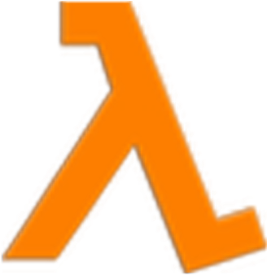

# LambdaBird
A purely functional flappy bird clone written using the Elm programming language as a challenge to learn a new language as well as implement a game in it at the same time. It took about a week to complete both learning the language and creating the game from scratch.

The core game is now complete but there is still as annoying bug (I don't think it is anything to do with my own implementation) where the image for the bird sometimes changes to an image of a pipe.

